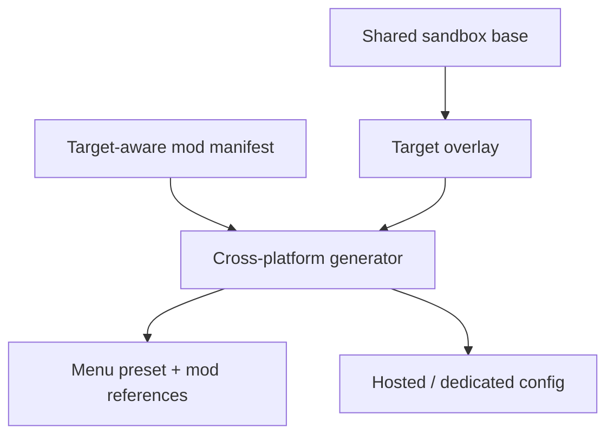

# Architecture

## Local path layer

`scripts/lib/local.sh` detects the Steam library containing Project Zomboid and derives:

- game directory;
- Workshop content directory for App `108600`;
- Project Zomboid user-data directory.

`scripts/install-local.sh` then installs named BLIND/SOLO/CO-OP artifacts without touching existing worlds. BLIND maps to the approved SOLO manifest column but applies its own no-world-map overlay.

## Dedicated layer

SteamCMD installs/updates dedicated App `380870`. `generate-config.sh server` renders server config from the same shared sandbox source. `launch-server.sh`, `backup.sh`, and `restore.sh` remain dedicated operations.

## Source ownership

- `config/sandbox/base.cfg` — common human-readable B42 settings.
- `config/profiles/*.cfg` — only target differences.
- `mods/manifest.tsv` — Workshop ID, Mod ID, dependency, load order, and SOLO/CO-OP/SERVER compatibility source of truth.
- `.generated/` — derived artifacts; intentionally ignored by Git.
- Steam Workshop payloads — remain distributed by their authors through Steam.

## Validation pipeline

GitHub Actions installs ShellCheck + Lua, runs `validate-mods.sh`, then `scripts/test.sh`. The mock test covers all profile renders, local Steam detection, save backup/preservation, BLIND preset installation, CO-OP named configuration, and dedicated install/update/launch/backup/restore without pretending that mocked CI is a real gameplay playtest.
